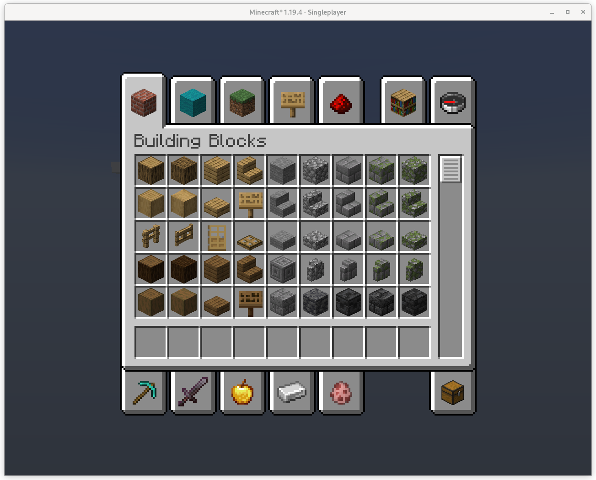
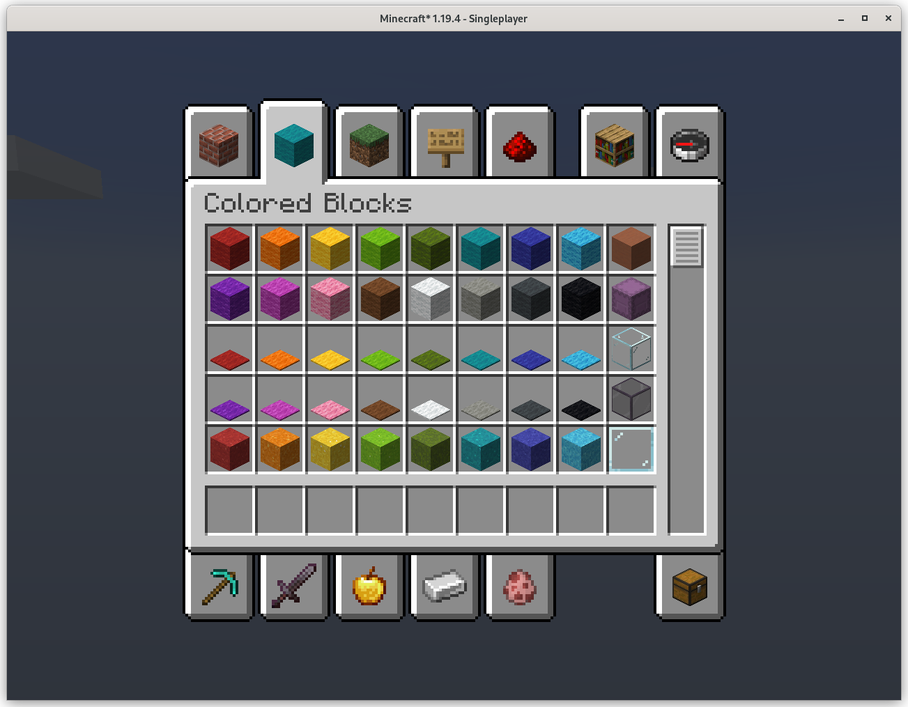
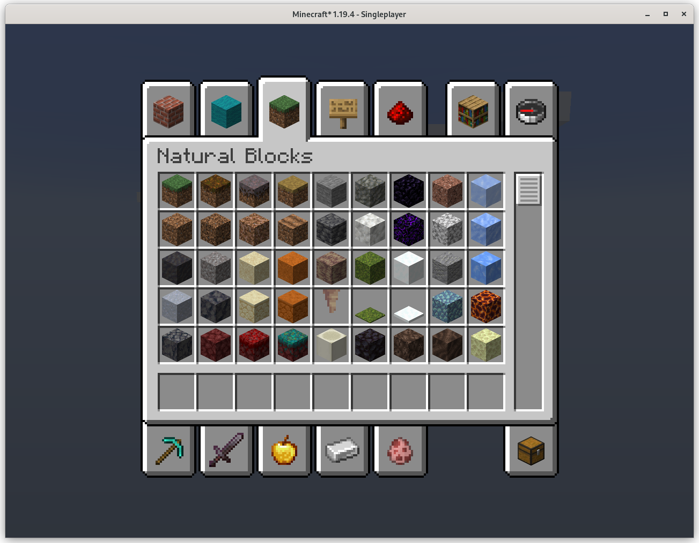
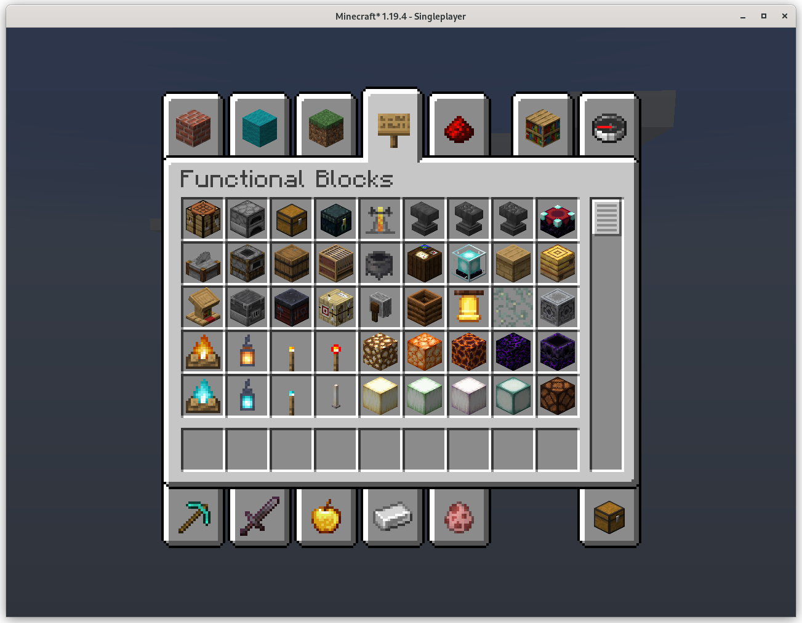
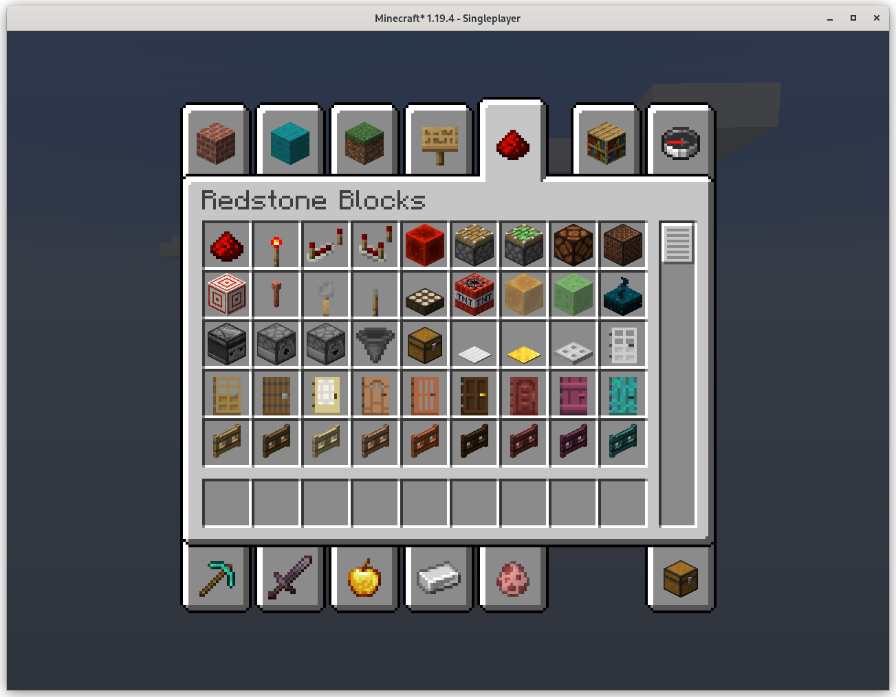
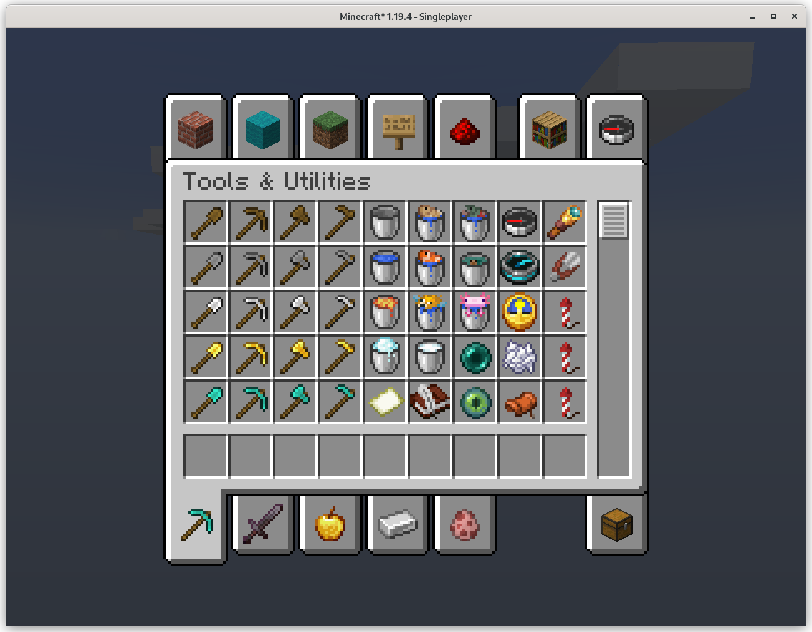
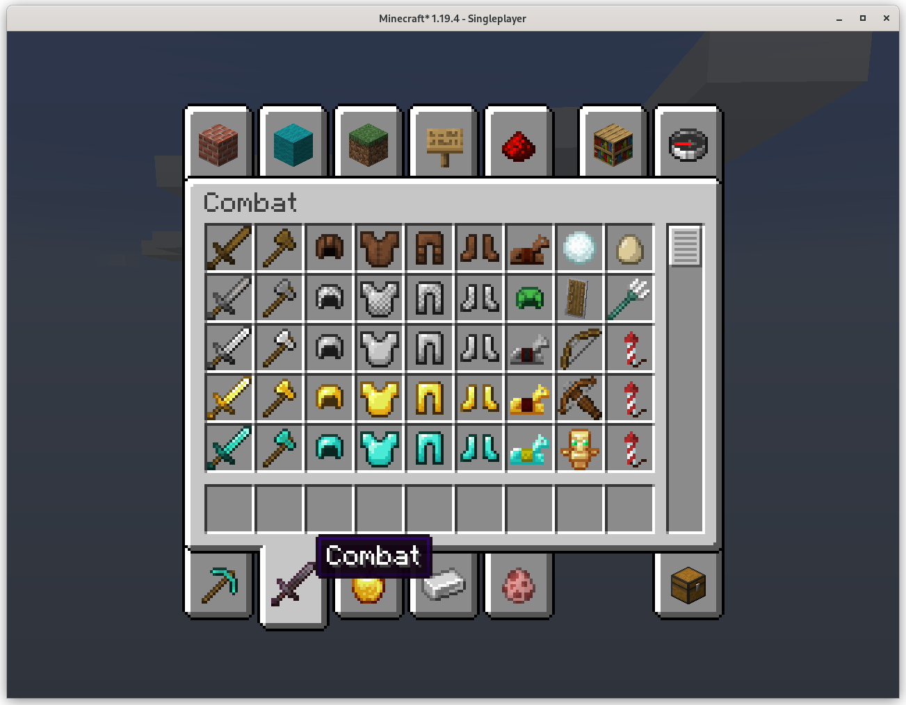
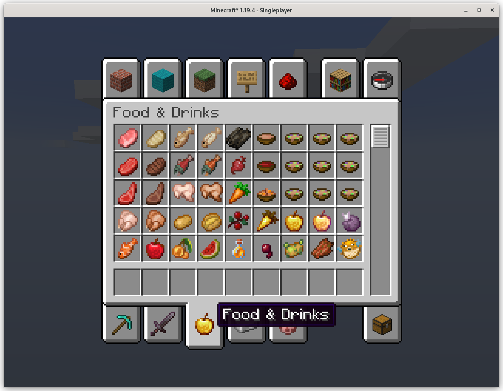
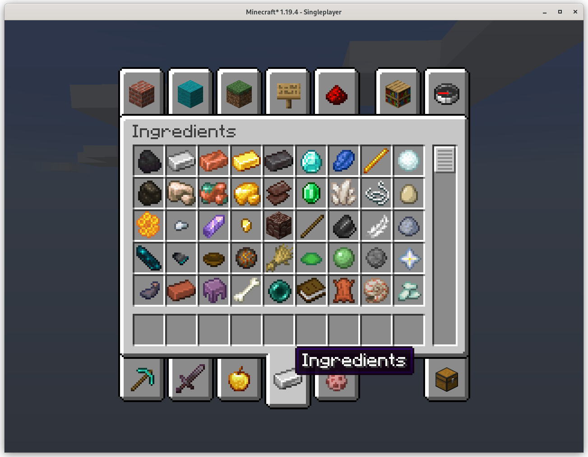

# Clean Creative Mod
Ever wished for a cleaner looking creative inventory? Well now it exists! Compatible with Sodium and Iris, too.

This is made for the Fabric mod loader and is not compatible with other mod loaders.

## Main differences
- Items are in a more convenient order
- Buttons and pressure plates are no longer under Building Blocks
- Signs are under Building Blocks
- Wood and blackstone variants are under Redstone again
- Removed functional blocks and wool from Redstone (Lectern, furnace, chest). 

## Download instructions
1. Make sure you have Fabric Loader installed.
2. Under "Releases", navigate to your desired version.
3. Download the file ending in ".jar".
4. Under the ".minecraft" folder, place it in the "mods" folder. 
If it doesn't exist, make one.
5. If Minecraft Fabric is running, restart the game.

## Notes/other plans
- I don't plan on making any changes to the search, inventory, or spawn eggs tabs.
- I'm currently working on a 1.20 update for this. Should be released either on or shortly after the game update.
- I'd like to revamp the hotbar tab once my 1.20 update is out.
- I'd also like to add the item grouping feature that Bedrock has 
(ex. right-clicking wood planks to display all variants)
- Kinda new to Git(hub) so this project is also to help me learn how to use the tool.

## Code
- [Click here](/src/main/java/me/gabriel/cleancreative) to navigate to code.
- 

## Images

## License
This project is available under the CC0 license. Feel free to learn from it and incorporate it in your own projects.